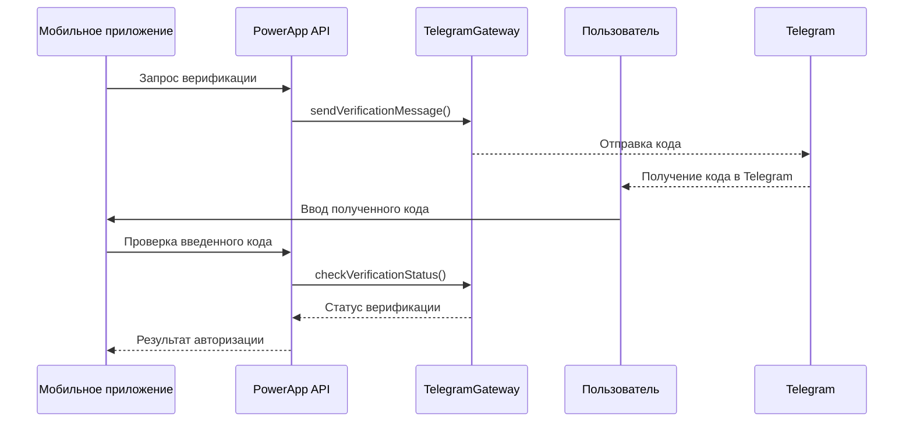

# PowerApp - Система авторизации

Техническая документация системы авторизации PowerApp с поддержкой SMS, голосовых вызовов и Telegram Bot авторизации на основе JWT токенов.

## Содержание

- [Участвующие модули](#участвующие-модули)
- [1. Архитектура авторизации](#1-архитектура-авторизации)
- [2. Методы авторизации](#2-методы-авторизации)
- [3. JWT токены и сессии](#3-jwt-токены-и-сессии)
- [4. API эндпоинты](#4-api-эндпоинты)
- [5. Блокировка пользователей](#5-блокировка-пользователей)
- [6. SMS провайдеры](#6-sms-провайдеры)
- [7. Лимиты и защита от спама](#7-лимиты-и-защита-от-спама)
- [8. Конфигурация](#8-конфигурация)

## Участвующие модули

| Компонент | Расположение | Роль в системе авторизации |
|-----------|--------------|----------------------------|
| **VerificationController** | `/api/app/Http/Controllers/API/V2/VerificationController.php` | Отправка SMS и голосовых кодов |
| **TelegramAuthController** | `/api/app/Http/Controllers/API/V2/TelegramAuthController.php` | Авторизация через Telegram Bot |
| **ClientController** | `/api/app/Http/Controllers/API/V2/ClientController.php` | Основная авторизация и управление профилем |
| **Client Model** | `/api/app/Models/Client.php` | Модель пользователя с JWT интеграцией |
| **VerificationService** | `/api/app/Services/VerificationService.php` | Логика верификации кодов |
| **SMS Services** | `/api/app/Infrastructure/AuthorizationServices/` | Интеграция с SMS/Voice провайдерами |
| **Telegram Handler** | `/api/app/Http/Controllers/Telegram/Handler.php` | Обработка команд Telegram Bot |
| **JWT Middleware** | `/api/app/Http/Middleware/` | Проверка JWT токенов |

## 1. Архитектура авторизации

### 1.1 Принципы работы

PowerApp использует авторизацию без паролей основанную на верификации номера телефона:

```
Мобильное приложение → Ввод телефона → Верификация → JWT токен → Авторизованный доступ
```

**Ключевые особенности**:
- Отсутствие паролей - только верификация телефона
- Поддержка нескольких каналов верификации (SMS, Voice, Telegram)
- JWT токены с практически неограниченным сроком действия
- Автоматическое восстановление пользователей после удаления

### 1.2 Архитектурные компоненты

```
┌─────────────────┐    ┌─────────────────┐    ┌─────────────────┐
│   Verification  │    │   SMS/Voice     │    │   Telegram Bot  │
│   Controllers   │    │   Providers     │    │   Integration   │
└─────────────────┘    └─────────────────┘    └─────────────────┘
         │                       │                       │
         └───────────────────────┼───────────────────────┘
                                 │
                    ┌─────────────────┐
                    │   JWT Service   │
                    │   & Middleware  │
                    └─────────────────┘
```

## 2. Методы авторизации

### 2.1 SMS верификация

**Назначение**: Основной метод авторизации через SMS сообщения

**Процесс**:
1. Пользователь вводит номер телефона
2. Система отправляет 4-значный код
3. Пользователь вводит код
4. Система генерирует JWT токен

**Провайдеры**:
- **SMS.RU** - основной провайдер
- **SMS Aero** - альтернативный провайдер

**Формат кода**: случайное число от 1000 до 9999

### 2.2 Голосовая верификация

**Назначение**: Альтернативный метод для пользователей, которые не могут получить SMS

**Процесс**:
1. Пользователь запрашивает голосовой вызов
2. Система инициирует звонок на указанный номер
3. Робот произносит 4-значный код
4. Пользователь вводит код для авторизации

**Провайдеры**:
- **VoicePassword** - основной провайдер голосовых вызовов
- **SMS.RU** - дополнительный провайдер с поддержкой голоса

### 2.3 Telegram Bot авторизация

**Назначение**: Быстрая авторизация через Telegram без ввода кода

**Процесс**:
1. Мобильное приложение получает ссылку на Telegram Bot
2. Пользователь взаимодействует с ботом
3. Бот запрашивает доступ к номеру телефона
4. Бот генерирует временный токен на 30 минут
5. Пользователь переходит по ссылке обратно в приложение
6. Приложение обменивает временный токен на JWT

**Истечение токена**: Если пользователь не воспользовался ссылкой в течение 30 минут, система отправляет уведомление с возможностью получения новой ссылки. Если пользователь уже авторизовался, повторные уведомления не отправляются.

**Проверка блокировки**: На этапе авторизации проверяется поле `active` пользователя. Если пользователь заблокирован (`active = false`), авторизация прерывается с сообщением "Your account has been blocked. Please contact support."

**Telegram Bot команды**:
- `/start` - начало авторизации
- Поделиться контактом - передача номера телефона

### 2.4 TelegramGateway - Инфраструктура верификации

**Назначение**: Инфраструктурная подсистема для отправки верификационных кодов через официальный Telegram Gateway API. Альтернативный канал доставки вместо SMS/Voice верификации.

#### Архитектура компонента

| Компонент | Расположение | Назначение |
|-----------|--------------|------------|
| **TelegramGatewayService** | `Infrastructure/TelegramGateway/src/Services/` | Основной сервис, реализует TelegramGatewayInterface |
| **HttpClientClient** | `Infrastructure/TelegramGateway/src/Http/` | HTTP клиент с настройками таймаутов |
| **CallbackService** | `Infrastructure/TelegramGateway/src/Services/` | Обработка webhooks от Telegram Gateway |
| **PhoneFormatterService** | `Infrastructure/TelegramGateway/src/Services/` | Форматирование номеров телефонов |

#### API методы

**TelegramGatewayInterface** предоставляет 4 основных метода:

| Метод | Входные данные | Возвращаемое значение | Назначение |
|-------|----------------|----------------------|------------|
| `sendVerificationMessage()` | SendVerificationMessageDTO | `RequestStatusDTO\|null\|string` | Отправка верификационного кода в Telegram |
| `checkSendAbility()` | string $phone | `RequestStatusDTO\|null\|string` | Проверка возможности отправки по номеру |
| `checkVerificationStatus()` | CheckVerificationStatusDTO | `RequestStatusDTO\|null\|string` | Проверка статуса верификации кода |
| `revokeVerificationMessage()` | RevokeVerificationMessageDTO | `bool` | Отмена верификационного сообщения |

#### Ключевые DTO структуры

**SendVerificationMessageDTO**:

| Поле | Тип | Описание |
|------|-----|----------|
| `phone_number` | string | Номер телефона получателя |
| `request_id` | string | Уникальный ID запроса |
| `code_length` | string | Длина кода (по умолчанию '4') |
| `ttl` | int | Время жизни кода в секундах (60) |
| `callback_url` | string | URL для webhooks |
| `payload` | string | Дополнительные данные |

**RequestStatusDTO**:

| Поле | Тип | Описание |
|------|-----|----------|
| `request_id` | string | ID запроса |
| `phone_number` | string | Номер телефона |
| `request_cost` | float | Стоимость запроса |
| `delivery_status` | DeliveryStatusDTO | Статус доставки |
| `verification_status` | VerificationStatusDTO | Статус верификации |

#### Статусы сообщений

**MessageStatusEnum** (статусы доставки):
- `sent` - Отправлено
- `delivered` - Доставлено  
- `read` - Прочитано
- `expired` - Истекло
- `revoked` - Отменено

**VerificationStatusEnum** (статусы верификации):
- `code_valid` - Код корректен
- `code_invalid` - Код неверен
- `code_max_attempts_exceeded` - Превышено максимальное количество попыток
- `expired` - Код истек

#### Подключение к API

**API Endpoint**: `https://gatewayapi.telegram.org/`

**Настройки HTTP клиента**:
- **timeout**: 10 секунд (ожидание ответа сервера)
- **connect_timeout**: 2 секунды (время на установку соединения)
- **Авторизация**: Bearer token из конфигурации
- **Формат данных**: JSON в теле запроса

#### Конфигурация

**Основные параметры** (config/telegram-gateway.php):

| Параметр | Назначение |
|----------|------------|
| `api_token` | Токен доступа к Telegram Gateway API |
| `sender_username` | Username бота для отправки сообщений |
| `callback_url` | URL endpoint для получения webhooks |
| `log_channel` | Канал логирования (по умолчанию 'auth') |
| `verify_official_bot_url` | URL для верификации официального бота |

#### Интеграция с авторизацией

**Связь с другими компонентами**:
- **TelegramGateway** отправляет верификационные коды через Telegram
- **Telegram Bot** ([раздел 2.3](#23-telegram-bot-авторизация)) обрабатывает пользовательские команды и авторизацию  
- **SMS/Voice** ([раздел 2.2](#22-smsvoice-верификация)) - альтернативные каналы верификации

**Схема верификации через TelegramGateway**:



#### Обработка ошибок и логирование

**Возвращаемые типы**: Методы `sendVerificationMessage()`, `checkSendAbility()` и `checkVerificationStatus()` возвращают `RequestStatusDTO|null|string`:
- **RequestStatusDTO** - успешный ответ от API
- **string** - сообщение об ошибке
- **null** - отсутствие ответа от API

**Логирование** (канал `'auth'`):

**Уровни логирования**:
- `error` - ошибка
- `notice` - уведомление
- `info` - информационное сообщение

| Событие | Уровень | Сообщение в логе | Логируемые поля |
|---------|---------|------------------|-----------------|
| Ошибка HTTP запроса к Telegram Gateway API | error | Telegram gateway error | error, method, params |
| IP блокировка (≥10 запросов/24ч) | notice | Пользователь временно заблокирован по IP для получения кода тг | phone |
| Ошибка проверки возможности отправки | error | Ability error | phone, error_message |
| Ошибка отправки верификационного кода | error | Telegram verification error | phone, user_ip, error_message |
| Получен webhook от Telegram Gateway | info | Telegram gateway callback | data |

## 3. JWT токены и сессии

### 3.1 Конфигурация JWT

**Основные параметры**:
- **Секретный ключ**: `JWT_SECRET` (для подписи токенов)
- **Время жизни**: `JWT_TTL = 999999999` минут
- **Обновление**: `JWT_REFRESH_TTL = 20160` минут (2 недели)
- **Алгоритм**: `HS256`
- **Blacklist**: возможность заблокировать токены до истечения срока

### 3.2 Структура JWT токена

**Структура JWT payload**:
```json
{
  "iss": string,
  "sub": integer,
  "exp": integer,
  "iat": integer,
  "nbf": integer,
  "jti": string
}
```

### 3.3 Жизненный цикл токена

1. **Генерация**: После успешной верификации
2. **Хранение**: В мобильном приложении
3. **Валидация**: JWT middleware на каждом запросе
4. **Обновление**: Автоматическое в течение 2 недель
5. **Отзыв**: Через blacklist при необходимости

## 4. API эндпоинты

### 4.1 VerificationController

#### Endpoints

Контроллер предоставляет следующие эндпоинты:

| Метод | URL | Описание |
|-------|-----|----------|
| POST | `/api/v2/user/verify/sms` | Отправка SMS кода для верификации |
| POST | `/api/v2/user/verify/call` | Инициация голосового вызова с кодом |
| POST | `/api/v3/user/verify/telegram` | Отправка кода через Telegram Gateway |

#### Отправка SMS кода
`POST /api/v2/user/verify/sms`

*Входные данные:*
Тело запроса (JSON):

| Параметр | Тип данных | Валидация | Описание |
|----------|------------|-----------|----------|
| phone | string | Обязательный, regex: `/^([0-9]){6,13}$/` | Номер телефона для верификации |

*Функционал:*
- Валидация номера телефона
- Проверка раздельного rate limit для SMS (30 секунд между SMS запросами)
- Генерация 4-значного кода (1000-9999)
- Отправка SMS через выбранного провайдера

*Выходные данные:*

Успешная отправка:
```json
{
    "success": true,
    "data": {}
}
```

Ошибка валидации:
```json
{
    "success": false,
    "message": string,
    "errors": {
        "phone": [string]
    }
}
```

*Обработка ошибок:*
- `422`: Ошибки валидации (неверный формат телефона, частые SMS запросы)

**Примечание**: Rate limit работает независимо для SMS, Telegram Gateway и голосовых вызовов. Пользователь может сразу запросить другой метод верификации.

#### Голосовой вызов
`POST /api/v2/user/verify/call`

*Входные данные:*
Тело запроса (JSON):

| Параметр | Тип данных | Валидация | Описание |
|----------|------------|-----------|----------|
| phone | string | Обязательный, regex: `/^([0-9]){6,13}$/` | Номер телефона для голосового вызова |

*Функционал:*
- Валидация номера телефона
- Проверка раздельного rate limit для голосовых вызовов (30 секунд между Call запросами)
- Генерация 4-значного кода
- Инициация голосового вызова через провайдера

*Выходные данные:*

Успешная инициация вызова:
```json
{
    "success": true,
    "data": {}
}
```

Ошибка валидации:
```json
{
    "success": false,
    "message": string,
    "errors": {
        "phone": [string]
    }
}
```

*Обработка ошибок:*
- `422`: Ошибки валидации (неверный формат телефона, частые Call запросы)

**Примечание**: Rate limit работает независимо для SMS, Telegram Gateway и голосовых вызовов. Пользователь может сразу запросить другой метод верификации.

#### Отправка кода через Telegram Gateway
`POST /api/v3/user/verify/telegram`

*Входные данные:*
Тело запроса (JSON):

| Параметр | Тип данных | Валидация | Описание |
|----------|------------|-----------|----------|
| phone | string | Обязательный, regex: `/^([0-9]){6,13}$/` | Номер телефона для верификации |

*Функционал:*
- Валидация номера телефона
- Проверка возможности отправки через Telegram Gateway API
- Генерация 4-значного кода (1000-9999) с TTL 5 минут
- Отправка кода через официальный Telegram Gateway API
- **Fallback на SMS**: автоматическая отправка SMS при недоступности Telegram Gateway
- **Rate limit устанавливается только после успешной отправки** (30 секунд)

*Выходные данные:*

Успешная отправка через Telegram:
```json
{
    "success": true,
    "data": {
        "success": true,
        "request_id": string,
        "verify_bot_url": string
    }
}
```

Fallback на SMS:
```json
{
    "success": true,
    "data": {
        "success": false,
        "message": string
    }
}
```

Ошибка валидации:
```json
{
    "success": false,
    "message": string,
    "errors": {
        "phone": [string]
    }
}
```

*Обработка ошибок и fallback:*
- **IP блокировка** (≥10 запросов за 24ч): автоматически отправляется SMS вместо Telegram
- **Telegram Gateway недоступен**: автоматически отправляется SMS
- **Ошибка отправки через Telegram**: автоматически отправляется SMS
- `422`: Ошибки валидации (неверный формат телефона)

**Важно**:
- **Нет проверки rate limit перед отправкой** - лимит устанавливается только после успешной отправки через Telegram
- При любых проблемах с Telegram Gateway система **автоматически переключается на SMS**
- Код действителен **5 минут** (TTL в Telegram Gateway)

**Отличия от Telegram Bot авторизации**:
- Telegram Gateway отправляет **код для ввода** в приложении (как SMS)
- Telegram Bot ([раздел 2.3](#23-telegram-bot-авторизация)) обеспечивает авторизацию **без ввода кода**
- Оба используют Telegram, но разные механизмы доставки

### 4.2 ClientController

#### Endpoints

| Метод | URL | Описание |
|-------|-----|----------|
| POST | `/api/v2/user/auth` | Авторизация по SMS/Voice коду |
| GET | `/api/v2/user/` | Получение профиля пользователя |
| PUT | `/api/v2/user/` | Обновление профиля |
| DELETE | `/api/v2/user/` | Удаление аккаунта |

#### Авторизация по SMS/Voice коду
`POST /api/v2/user/auth`

*Входные данные:*
Тело запроса (JSON):

| Параметр | Тип данных | Валидация | Описание |
|----------|------------|-----------|----------|
| phone | string | Обязательный, regex: `/^([0-9]){6,13}$/` | Номер телефона |
| code | string | Обязательный, numeric | Код верификации (валидация длины на уровне бизнес-логики) |
| request_id | string | Опциональный, nullable | ID запроса от Telegram Gateway для проверки кода через API |

*Функционал:*
- Валидация кода верификации
- Поиск или создание пользователя
- Генерация JWT токена
- Восстановление soft-deleted пользователей

*Выходные данные:*

Возвращает JWT токен и данные пользователя:
```json
{
    "success": true,
    "data": {
        "token": string,
        "user": {
            "id": integer,
            "phone": string|null
        }
    }
}
```

Ошибка валидации:
```json
{
    "success": false,
    "message": string,
    "errors": {
        "code": [string]
    }
}
```

*Обработка ошибок:*
- `422`: Ошибки валидации (неверный формат данных, неверный код, заблокированный аккаунт)

#### Получение профиля
`GET /api/v2/user/`

*Входные данные:*
Authorization: Bearer {jwt_token}

*Функционал:*
- Получение данных авторизованного пользователя
- Включение связанных данных (активная аренда, способы оплаты)

*Выходные данные:*

Возвращает данные профиля пользователя:
```json
{
    "success": true,
    "data": {
        "id": integer,
        "name": string|null,
        "phone": string|null,
        "active_rent": object|null,
        "debt": float,
        "cards": array,
        "last_payment_type": string|null,
        "partner": boolean,
        "is_tester": boolean,
        "has_apple_pay": boolean,
        "has_google_pay": boolean
    }
}
```

Ошибка аутентификации:
```json
{
    "success": false,
    "message": string
}
```

#### Обновление профиля
`PUT /api/v2/user/`

*Входные данные:*

Заголовки:

| Заголовок | Тип данных | Валидация | Описание |
|-----------|------------|-----------|----------|
| Authorization | string | Обязательный | Bearer токен для аутентификации: `Bearer {jwt_token}` |
| Accept-language | string | Опциональный | Язык интерфейса: `ru`, `en` |

Тело запроса (JSON):

| Параметр | Тип данных | Валидация | Описание |
|----------|------------|-----------|----------|
| locale | string | Опциональный | Язык интерфейса. Возможные значения: `ru`, `en` |

> **Требование:** Необходимо передать хотя бы один из параметров: `locale` (в теле запроса) или `Accept-language` (в заголовках). При передаче обоих используется значение из `locale`.

*Функционал:*
- Обновление языка интерфейса пользователя
- Приоритет выбора языка: параметр `locale` → заголовок `Accept-language`
- Сохранение выбранного языка в профиле пользователя
- Валидация входящих данных

*Выходные данные:*

Успешное обновление:
```json
{
    "success": true,
    "data": {}
}
```

Ошибка валидации (не передан ни один параметр):
```json
{
    "success": false,
    "message": "The given data was invalid.",
    "errors": {
        "local": ["The local field is required."]
    }
}
```

*Обработка ошибок:*
- `422`: Ошибки валидации (не передан `locale` и `Accept-language`)
- `401`: Неавторизованный доступ

#### Удаление аккаунта
`DELETE /api/v2/user/`

*Входные данные:*
Authorization: Bearer {jwt_token}

*Функционал:*
- Проверка на наличие активных арендов
- Проверка на наличие долгов
- Soft delete пользователя
- Автоматическое удаление связанных данных:
  - Способы оплаты (payment_methods)
  - История аренды (rent_histories)
  - Реферальные связи

*Выходные данные:*

Успешное удаление:
```json
{
    "success": true,
    "data": {}
}
```

Ошибка при наличии долга или активной аренды:
```json
{
    "success": false,
    "message": string
}
```

*Обработка ошибок:*
- `422`: У пользователя есть долг или активная аренда
- `401`: Неавторизованный доступ

### 4.3 TelegramAuthController

#### Endpoints

| Метод | URL | Описание |
|-------|-----|----------|
| GET | `/api/v2/user/auth/telegram` | Получение URL Telegram Bot |
| POST | `/api/v2/user/auth/telegram` | Авторизация через Telegram токен |

#### Получение Telegram Bot URL
`GET /api/v2/user/auth/telegram`

*Входные данные:* -

*Функционал:*
- Возврат URL для перехода к Telegram Bot
- Формирование deep link для авторизации

*Выходные данные:*

Возвращает URL для перехода к Telegram Bot:
```json
{
    "success": true,
    "data": {
        "url": string
    }
}
```

#### Авторизация через Telegram
`POST /api/v2/user/auth/telegram`

*Входные данные:*
Тело запроса (JSON):

| Параметр | Тип данных | Валидация | Описание |
|----------|------------|-----------|----------|
| token | string | Обязательный, size: 17 | Временный токен от Telegram Bot |

*Функционал:*
- Валидация временного токена
- Проверка срока действия (30 минут)
- Получение номера телефона из токена
- Создание или восстановление пользователя
- Генерация JWT токена

*Выходные данные:*

Возвращает JWT токен и данные пользователя:
```json
{
    "success": true,
    "data": {
        "token": string,
        "user": {
            "id": integer,
            "phone": string|null
        }
    }
}
```

Ошибка валидации или авторизации:
```json
{
    "success": false,
    "message": string
}
```

*Обработка ошибок:*
- `403`: Токен не найден или истек срок действия
- `422`: Ошибки валидации (неверный формат токена)

## 5. Блокировка пользователей

### 5.1 Общий принцип

Система блокирует доступ неактивным пользователям на уровне middleware и бизнес-логики. Блокировка основана на boolean поле `active` модели `Client`:
- `true` - пользователь активен, может пользоваться системой
- `false` - пользователь заблокирован, доступ к авторизации и аренде запрещён

### 5.2 Middleware блокировки

**Middleware**: `EnsureClientIsActive`

**Механизм работы**:
1. Извлекает параметр `phone` из тела запроса
2. Проверяет наличие клиента с этим номером в базе данных
3. Если клиент найден и `active === false`, блокирует запрос
4. Если клиент не найден или активен, пропускает запрос дальше

**Важно**: Проверка происходит ДО создания нового пользователя, что предотвращает повторную регистрацию заблокированных клиентов.

### 5.3 Защищённые эндпоинты

Middleware применяется к следующим эндпоинтам:

| Эндпоинт | Назначение |
|----------|-----------|
| `POST /api/v2/user/verify/sms` | Отправка SMS кода |
| `POST /api/v2/user/verify/call` | Голосовой вызов |
| `POST /api/v3/user/verify/telegram` | Telegram Gateway код |
| `GET /api/v2/user/auth/telegram` | Получение Telegram Bot URL |
| `POST /api/v2/user/auth/telegram` | Авторизация через Telegram Bot |
| `POST /api/v2/user/auth` | Авторизация по коду |

### 5.4 Дополнительная защита в бизнес-логике

При создании аренды (`CreateRentService`) выполняется дополнительная проверка активности клиента. Это защищает от случаев, когда пользователь был заблокирован уже после авторизации.

### 5.5 HTTP ответ при блокировке

При попытке заблокированного пользователя получить доступ к защищённым эндпоинтам возвращается:

**HTTP статус**: `422 Unprocessable Entity`

**Структура**:
```json
{
    "success": false,
    "message": "Your account has been blocked. Please contact support."
}
```

**Применяется при**:
- Запросе кода верификации (SMS/Call/Telegram)
- Авторизации через любой метод
- Создании аренды (сообщение отличается)

## 6. SMS провайдеры

### 6.1 SMSRUService
**Возможности**:
- Отправка SMS и голосовых сообщений
- Проверка баланса и статуса доставки
- Конфигурация: `services.smsru.token`

**Шаблон сообщения**: `"{code} - powerapp.world"`

### 6.2 SMSAeroService
**Возможности**:
- Альтернативный SMS провайдер
- Базовая авторизация (login/token)
- Конфигурация: `services.sms-aero.*`

**Шаблон сообщения**: `"Код авторизации в приложении PowerApp: {code} ! https://powerapp.world/"`

### 6.3 VoicePasswordService
**Возможности**:
- Голосовые вызовы с произношением кода
- Конфигурация: `services.vp.*`


## 7. Лимиты и защита от спама

### 7.1 Rate Limiting верификации

Система использует **раздельные rate limits** для каждого метода верификации (SMS, Telegram Gateway, голосовые вызовы), что позволяет пользователям пробовать разные каналы доставки кода без ожидания. Например: отправить SMS → сразу запросить Telegram код → сразу запросить голосовой вызов.

**Ограничения по каналам**:
- **SMS и голосовые вызовы**: 30 секунд между запросами на один номер телефона
- **Telegram Gateway**: 30 секунд между запросами на один номер телефона (устанавливается только после успешной отправки)
- **IP блокировка**: 10 запросов за 24 часа с одного IP (для всех методов)

**Техническая реализация**:
- **Хранилище**: Laravel Cache (драйвер: Redis)
- **Rate limit ключи**: каждый метод использует отдельный ключ формата `verification_rate_limit_{method}:{phone}` (где method = sms, telegram или call) с TTL 30 секунд
- **Коды верификации**: `verification_code:{phone}` с TTL 5 минут
- **IP блокировка**: `user_ip_{ip}` с TTL 24 часа (IP определяется из HTTP запроса)
- **Проверка лимитов**: SMS и Call проверяются перед отправкой, Telegram после успешной отправки
- **При ошибках Telegram**: автоматический fallback на SMS без установки Telegram rate limit
- **Методы репозитория**: `VerificationRepository::canSend{Method}()` для проверки доступности

### 7.2 Временные ограничения

**Срок действия данных**:
- **Коды верификации**: 5 минут (TTL в кеше)
- **Временные токены Telegram Bot**: 30 минут
- **Автоматическая очистка**: устаревшие коды удаляются автоматически

### 7.3 Тестовые номера

**Тестовые номера для разработки**:
- `79000000000` → код `1111`
- `79000000001` → код `2222`
- `79000000002` → код `3333`

**Особенности**:
- Не отправляют реальные SMS/вызовы
- Обходят rate limiting
- Используются только в dev-окружении


## 8. Конфигурация

### 8.1 Переменные окружения

```bash
# JWT токены
JWT_SECRET=your-secret-key
JWT_TTL=999999999
JWT_REFRESH_TTL=20160
JWT_ALGO=HS256
JWT_BLACKLIST_ENABLED=true

# Выбор SMS провайдера
AUTH_SERVICE=smsru
AUTH_SERVICE_CALL=voicepassword
AUTH_SERVICE_URL=https://sms.ru

# SMS.RU
SMSRU_TOKEN=your-smsru-token

# SMS Aero
SMS_AERO_LOGIN=your-login
SMS_AERO_TOKEN=your-token
SMS_AERO_URL=https://gate.smsaero.ru

# VoicePassword
VP_LOGIN=your-login
VP_TOKEN=your-token
VP_URL=https://voicepassword.ru

# Telegram Bot
TELEGRAM_BOT_TOKEN=your-bot-token
TELEGRAM_BOT_USERNAME=powerapp_bot

# Тестовые номера
USER_TEST=79000000000
USER_TEST_CODE=1111
```

---

Система авторизации PowerApp обеспечивает безопасную и удобную авторизацию пользователей через несколько каналов с использованием современных технологий JWT и надежной валидации. 