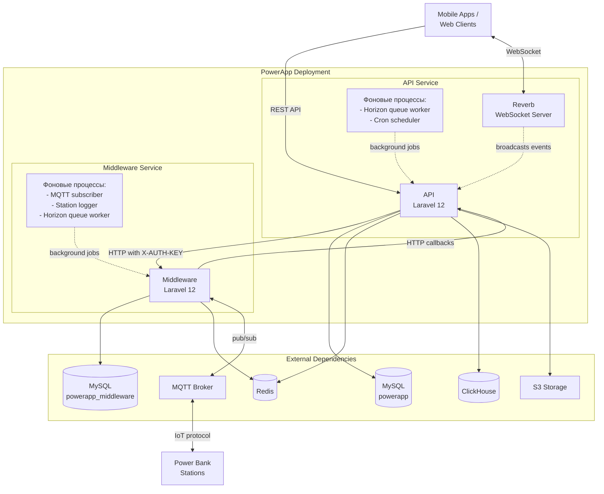

# PowerApp - Deployment Guide

Практическое руководство по развертыванию PowerApp - от быстрого старта до production deployment с CI/CD.

## Содержание

- [Обзор](#обзор)
- [Production развертывание](#production-развертывание)
- [CI/CD Pipeline](#cicd-pipeline)
- [После развертывания](#после-развертывания)
- [Эксплуатация](#эксплуатация)
- [Устранение неполадок](#устранение-неполадок)

## Обзор

PowerApp - это IoT платформа для аренды пауэрбанков, состоящая из двух основных серверных компонентов:



**Компоненты для развертывания:**
- **API** - бизнес-логика, управление пользователями, платежи, аренды
- **Reverb** - WebSocket сервер для real-time коммуникации с клиентами
- **Middleware** - связь со станциями через MQTT протокол

## Production развертывание

Production deployment использует Docker с GitLab CI/CD или ручное развертывание.

### Структура Docker образов

**API сервис** развернут в нескольких контейнерах, использующих единый базовый образ:

1. **Базовый образ** (`/api/docker/php/8.4/Dockerfile`):
   - Базовый образ: `php:8.4-fpm-alpine3.20`
   - Системные пакеты: `patch`, `make`, `bash`, `dcron`, `logrotate`, `git`, `ffmpeg`
   - Установка PHP расширений через `install-php-extensions`
   - Установка Composer зависимостей: `composer install --optimize-autoloader --no-dev`
   - Установка RoadRunner binary: `./vendor/bin/dload get rr`
   - Настройка cron для scheduled задач
   - Настройка автоматической ротации логов cron задач
   - Работает от пользователя `www-data`

2. **RoadRunner HTTP Server** (конфигурация: `/api/.rr.yaml`):
   - Команда запуска: `./rr serve -c .rr.yaml`
   - HTTP адрес: `0.0.0.0:8080`
   - Количество воркеров: 16
   - Лимит памяти воркера: 384 MB
   - Встроенные middleware: static files, gzip compression, HTTP metrics
   - RPC endpoint: `tcp://0.0.0.0:6001`
   - Prometheus metrics: `0.0.0.0:9180`

**Преимущества RoadRunner:**
- Высокая производительность за счет длительных PHP процессов
- Встроенная поддержка static файлов и gzip сжатия
- Prometheus-совместимые метрики из коробки
- Автоматический перезапуск воркеров при превышении лимита памяти

3. **Reverb WebSocket Server** (конфигурация: `/api/config/reverb.php`):
   - Команда запуска: `php artisan reverb:start`
   - Порт контейнера: `6006`
   - Traefik entrypoint: `websocket` (WSS protocol)
   - Назначение: Real-time двусторонняя коммуникация с клиентами

**Обязательные ENV переменные для Reverb:**
- `REVERB_APP_KEY` - ключ приложения для аутентификации
- `REVERB_APP_SECRET` - секретный ключ
- `REVERB_APP_ID` - ID приложения
- `REVERB_HOST` - хост для клиентских подключений (внешний домен)

**Использование:** WebSocket события для real-time уведомлений о статусе аренды, изменениях станций и других событий системы.

4. **Дополнительные контейнеры:**
   - **Horizon** - обработка фоновых задач (`php artisan horizon`)
   - **Cron** - выполнение scheduled задач (`/cron.sh`)

### Traefik Load Balancer и Reverse Proxy

**Назначение:** Traefik выступает как reverse proxy и load balancer для всех контейнеров API сервиса, обеспечивая маршрутизацию HTTP/HTTPS/WebSocket трафика, автоматическое получение SSL сертификатов и проверку работоспособности.

**Архитектура:**

Traefik настраивается через Docker labels с динамической конфигурацией при запуске/остановке контейнеров.

**Traefik Services:**
- `${APP_ROUTE_NAME}` - маршрутизация на RoadRunner HTTP server (порт 8080)
- `${APP_ROUTE_NAME}-ws` - маршрутизация на Reverb WebSocket server (порт 6006)

**Traefik Routers:**

1. **HTTP Router** (`${APP_ROUTE_NAME}-http`):
   - Entrypoint: `web` (HTTP)
   - Rule: `Host(${EXT_DOMAIN})`
   - Middleware: автоматический постоянный redirect на HTTPS

2. **HTTPS Router** (`${APP_ROUTE_NAME}`):
   - Entrypoint: `websecure` (HTTPS)
   - Rule: `Host(${EXT_DOMAIN})`
   - TLS: автоматические сертификаты через `myresolver`
   - Middleware: gzip compression

3. **WebSocket Router** (`${APP_ROUTE_NAME}-ws`):
   - Entrypoint: `websocket` (WSS)
   - Rule: `Host(${EXT_DOMAIN})`
   - TLS: автоматические сертификаты через `myresolver`

**Traefik Middlewares:**
- `${APP_ROUTE_NAME}-redirect-https` - постоянный редирект HTTP → HTTPS
- `${APP_ROUTE_NAME}-compress` - gzip сжатие ответов

**Health Checks:**
- Path: `/api/v1/health`
- Interval: 1s (на уровне Traefik load balancer)
- Дополнительно: health check на уровне контейнера (interval: 30s, timeout: 10s, retries: 3)

**SSL/TLS:**
- Cert resolver: `myresolver` (настраивается на уровне Traefik)
- Автоматическое получение и обновление сертификатов

**External Network:**

Все контейнеры подключены к внешней сети `traefik`:

```yaml
networks:
  traefik:
    external: true
```

**Важно:** Сеть `traefik` должна быть создана до запуска контейнеров:

```bash
docker network create traefik
```

**Обязательные ENV переменные для Docker Compose:**

Эти переменные передаются через GitLab CI/CD переменные `PROD_ENV`, `PREPROD_ENV`, `DEV_ENV`, `DEV2_ENV`, `TEST_ENV` (тип: file) и используются в docker-compose конфигурации:

- `COMPOSE_PROJECT_NAME` - префикс для имен контейнеров
- `APP_ROUTE_NAME` - базовое имя для Traefik роутеров и сервисов
- `EXT_DOMAIN` - внешний домен для маршрутизации
- `APP_BASE_IMAGE` - Docker образ для развертывания (формат: `${CI_REGISTRY_IMAGE}/app-base:${CI_COMMIT_REF_NAME}-${PREFIX}-${CI_COMMIT_SHORT_SHA}`)

**Примечание:** Конфигурация Traefik entrypoints (`web`, `websecure`, `websocket`) и cert resolver (`myresolver`) находится на уровне самого Traefik сервера, не приложения.

### Конфигурация окружения

#### Обязательные параметры (.env)

**API:**
```bash
# Application
APP_NAME=PowerApp
APP_ENV=production
APP_KEY=                    # php artisan key:generate
APP_DEBUG=false
APP_URL=https://api.powerapp.world
FORCE_HTTPS=true

# Database
DB_CONNECTION=mysql
DB_HOST=mysql-host
DB_PORT=3306
DB_DATABASE=powerapp
DB_USERNAME=powerapp_user
DB_PASSWORD=***

# Redis
REDIS_HOST=redis-host
REDIS_PASSWORD=***
REDIS_PORT=6379
CACHE_DRIVER=redis
QUEUE_CONNECTION=redis
BROADCAST_DRIVER=redis

# ClickHouse
CLICKHOUSE_HOST=clickhouse-host
CLICKHOUSE_PORT=8123
CLICKHOUSE_DATABASE=powerapp
CLICKHOUSE_USERNAME=default
CLICKHOUSE_PASSWORD=***
CLICKHOUSE_HTTPS=true

# S3 Storage
AWS_ACCESS_KEY_ID=***
AWS_SECRET_ACCESS_KEY=***
AWS_DEFAULT_REGION=ru-msk
AWS_BUCKET=powerapp
AWS_URL=https://hb.vkcs.cloud
AWS_ENDPOINT=https://hb.vkcs.cloud

# Reverb WebSocket
REVERB_APP_KEY=***
REVERB_APP_SECRET=***
REVERB_APP_ID=***
REVERB_HOST=api.powerapp.world

# JWT
JWT_SECRET=                 # php artisan jwt:secret

# Middleware Integration
MIDDLEWARE_BASE_URL=https://middleware.powerapp.world
MIDDLEWARE_KEY=***

# Payment
PAYMENT_SYSTEM=cloudpayments
CLOUDPAYMENTS_SECRET=***
CLOUDPAYMENTS_PUBLIC=***

# SMS Authentication
AUTH_SERVICE=smsru
SMSRU_API_ID=***
```

**Middleware:**
```bash
# Application
APP_NAME="PowerApp Middleware"
APP_ENV=production
APP_KEY=                    # php artisan key:generate
APP_DEBUG=false
APP_URL=https://middleware.powerapp.world

# Database
DB_CONNECTION=mysql
DB_HOST=mysql-host
DB_PORT=3306
DB_DATABASE=powerapp_middleware
DB_USERNAME=middleware_user
DB_PASSWORD=***

# Redis
REDIS_HOST=redis-host
REDIS_PASSWORD=***
REDIS_PORT=6379
CACHE_DRIVER=redis
QUEUE_CONNECTION=redis

# MQTT (обязательно)
MQTT_HOST=mqtt.powerapp.local
MQTT_PORT=1883
MQTT_AUTH_USERNAME=powerapp_mqtt
MQTT_AUTH_PASSWORD=***

# PowerApp API
POWER_APP_API_URL=https://api.powerapp.world
```

**Полный список параметров:** см. `/api/.env.example` и `/middleware/.env.example`

#### Опциональные параметры FFmpeg (API)

FFmpeg используется для обработки видео в Stories и Reviews. По умолчанию используются системные бинарные файлы:

```bash
# FFmpeg конфигурация (опционально)
FFMPEG_BINARIES=ffmpeg          # Путь к бинарному файлу ffmpeg (по умолчанию: ffmpeg)
FFPROBE_BINARIES=ffprobe        # Путь к бинарному файлу ffprobe (по умолчанию: ffprobe)
FFMPEG_THREADS=3                # Количество потоков для обработки видео (по умолчанию: 3)
FFMPEG_TEMPORARY_FILES_ROOT=    # Директория для временных файлов (по умолчанию: sys_get_temp_dir())
```

**Назначение:** Сжатие и конвертация видео в формат X264 (MP4) с битрейтом 2000 kbps.
**Подробнее:** см. раздел [CompressVideoJob](README_jobs_events.md#3-compressvideojob) в документации по Jobs.

### RoadRunner (prod)

Прод окружение использует RoadRunner (`/api/.rr.yaml`) со следующими параметрами:
- `num_workers = 16`: количество PHP-воркеров
- `max_worker_memory = 384 MB`: лимит памяти воркера, при превышении supervisor перезапускает процесс
- Подключенные middleware: `static`, `gzip`, `http_metrics`
- Метрический endpoint доступен на `0.0.0.0:9180` (Prometheus-совместимые метрики)

### Ручное развертывание

Если не используете CI/CD:

```bash
# 0. Создать внешнюю сеть для Traefik (если еще не создана)
docker network create traefik

# 1. Получить код
git clone <repository-url>
cd api

# 2.1. Создать .env с production переменными приложения
# Полный список переменных см. в разделе "Конфигурация окружения"

# 2.2. Добавить переменные Docker Compose в .env
cat >> .env << 'EOF'
COMPOSE_PROJECT_NAME=powerapp_prod
APP_ROUTE_NAME=api-powerapp
EXT_DOMAIN=api.powerapp.world
APP_BASE_IMAGE=powerapp-api:latest
EOF

# 3. Собрать Docker образ
docker build -t powerapp-api:latest -f docker/php/8.3/Dockerfile .

# 4. Zero-downtime запуск (аналогично CI)
# 4.1 Протянуть свежие образы (если используются registry)
docker-compose -f docker-compose-deploy-prod.yml -f docker-compose-deploy-prod-first.yml -f docker-compose-deploy-prod-test.yml pull -q
# 4.2 Прогнать миграции в тестовом контейнере
docker-compose -f docker-compose-deploy-prod-test.yml up --exit-code-from=migration migration
# 4.3 Пробный запуск новой версии без миграций
docker-compose -f docker-compose-deploy-prod-test.yml up --wait --scale migration=0
# 4.4 Blue-green switch: старт первого prod контейнера
docker-compose -f docker-compose-deploy-prod-first.yml -f docker-compose-deploy-prod-test.yml up -d --wait --scale migration=0 --scale app-test=0
# 4.5 Полный переход на новую версию
docker-compose -f docker-compose-deploy-prod.yml up -d --wait
# 4.6 Удалить старые контейнеры
docker-compose -f docker-compose-deploy-prod.yml -f docker-compose-deploy-prod-first.yml up -d --wait --scale app-first=0 --remove-orphans
```

> **Примечание:** `docker-compose-deploy-*.yml` используют Traefik для маршрутизации. Убедитесь, что:
> - Внешняя сеть `traefik` создана (`docker network create traefik`)
> - Traefik entrypoints настроены: `web`, `websecure`, `websocket`
> - Cert resolver `myresolver` настроен
>
> Подробнее см. раздел [Traefik Load Balancer и Reverse Proxy](#traefik-load-balancer-и-reverse-proxy)

### Middleware развертывание

**Важно:** Middleware использует **git-based deployment**. Развертывание происходит через git pull с последующим обновлением зависимостей и перезапуском фоновых процессов.

**Архитектура развертывания:**

```
GitLab Push (master) → GitLab CI/CD →
git pull → composer install → migrate → optimize →
supervisorctl restart all
```

#### Требования к серверу

- PHP 8.4+ с расширениями (см. `/middleware/composer.json`)
- Composer
- Git
- Supervisor (для управления фоновыми процессами)
- Доступ к MySQL, Redis, MQTT broker

#### Процесс развертывания

**Автоматическое развертывание (GitLab CI/CD):**

```bash
# Выполняется автоматически при push в master
cd /home/middleware/middleware.powerapp.world
git pull origin master:master
composer install --optimize-autoloader --no-dev
php artisan migrate --force
php artisan optimize:clear
php artisan optimize
php artisan storage:link
sudo supervisorctl restart all
```

**Ручное развертывание:**

```bash
# 1. Перейти в директорию проекта
cd /home/middleware/middleware.powerapp.world

# 2. Получить обновления
git pull origin master

# 3. Обновить зависимости
composer install --optimize-autoloader --no-dev

# 4. Выполнить миграции
php artisan migrate --force

# 5. Очистить и пересоздать кеши
php artisan optimize:clear
php artisan optimize

# 6. Обновить символические ссылки
php artisan storage:link

# 7. Перезапустить фоновые процессы
sudo supervisorctl restart all
```

#### Конфигурация окружения

Переменные окружения для Middleware см. в разделе "Конфигурация окружения → Middleware".

**Критически важные переменные:**
- `MQTT_HOST`, `MQTT_PORT`, `MQTT_AUTH_USERNAME`, `MQTT_AUTH_PASSWORD` - подключение к MQTT broker
- `POWER_APP_API_URL` - URL основного API сервиса
- `DB_*` - подключение к базе данных
- `REDIS_*` - подключение к Redis

#### Фоновые процессы (Supervisor)

Middleware требует запущенных фоновых процессов для полноценной работы:

**Обязательные процессы:**

1. **MQTT Subscriber** - подписка на сообщения от станций
   ```bash
   php artisan mqtt:subscribe
   ```

2. **Station Message Logger** - обработка сообщений от станций
   ```bash
   php artisan logging:station-message --Q
   ```

3. **Horizon** - обработка фоновых задач
   ```bash
   php artisan horizon
   ```

> **Примечание:** Конфигурация Supervisor не хранится в репозитории и настраивается на сервере индивидуально.

**Управление процессами:**

```bash
# Перезапустить все процессы
sudo supervisorctl restart all
```

**Важно:** После любого обновления кода необходимо перезапускать все Supervisor процессы (`supervisorctl restart all`), так как они работают с длительными PHP процессами.

#### GitLab CI/CD конфигурация

**Переменные:**
- `PROJECTROOT` - путь к проекту на сервере (`/home/middleware/middleware.powerapp.world`)

**GitLab Runner:**
- Tag: `powerapp-middleware-prod`
- Требует sudo права для `supervisorctl`

**Конфигурация:** см. `/middleware/.gitlab-ci.yml`

## CI/CD Pipeline

PowerApp использует GitLab CI/CD для автоматического deployment.

### Pipeline структура

**Stages:**
1. `prebuild` - подготовка
2. `build` - сборка Docker образов
3. `check` - линтеры (rector, php-cs-fixer, composer-unused)
4. `tests` - PHPUnit тесты с coverage
5. `static-analyze` - PHPStan анализ
6. `deploy` - развертывание
7. `notification` - уведомления

### Environments

Настроены 4 окружения с автоматическим deployment:

| Branch | Environment | Deploy trigger |
|--------|-------------|----------------|
| `master` | Production | Push to master |
| `preprod` | Pre-production | Push to preprod |
| `dev` | Development | Push to dev |
| `dev2` | Stand | Push to dev2 |

### Build процесс

**Для каждого environment:**

1. Создается `.env` файл из GitLab CI/CD переменных (`${PROD_ENV}`, `${PREPROD_ENV}`, `${DEV_ENV}`, `${DEV2_ENV}`, `${TEST_ENV}`)
2. Собирается Docker образ через Kaniko:
   - Используются registry mirrors для ускорения
   - Включено кеширование слоев
   - Тег образа: `${CI_REGISTRY_IMAGE}/app-base:${CI_COMMIT_REF_NAME}-${PREFIX}-${CI_COMMIT_SHORT_SHA}`

3. Образ публикуется в GitLab Container Registry

### Deploy процесс

**Zero-downtime deployment:**

```bash
# 1. Pull новых образов
docker-compose pull

# 2. Запустить миграции в тестовом контейнере
docker-compose up --exit-code-from=migration migration

# 3. Запустить новую версию в тестовом режиме
docker-compose up --wait --scale migration=0

# 4. Blue-green switch: запустить первый prod контейнер
docker-compose up -d --wait --scale migration=0 --scale app-test=0

# 5. Полный переход на новую версию
docker-compose up -d --wait

# 6. Удалить старые контейнеры
docker-compose up -d --wait --scale app-first=0 --remove-orphans
```

### Code Quality Gates

**Merge Request проверки:**
- Rector (код модернизация)
- PHP CS Fixer (code style)
- PHPStan level 8 (static analysis)
- Composer require checker
- Composer unused packages
- PHPUnit tests с coverage

**Coverage требования:**
- Минимальный coverage визуализируется в GitLab
- Artifacts сохраняются 30 дней

### GitLab CI/CD настройка

**Required CI/CD variables:**

```bash
# Environment configs (file type)
PROD_ENV       # Production .env file
PREPROD_ENV    # Pre-production .env file
DEV_ENV        # Development .env file
DEV2_ENV       # Stand .env file
TEST_ENV       # Test .env file

# Registry access
CI_REGISTRY_USER      # GitLab registry username
CI_REGISTRY_PASSWORD  # GitLab registry password
```

**Required GitLab Runners:**
- `powerapp-dind-build` - для сборки (Docker-in-Docker)
- `powerapp-dind-prod-deploy` - для production deploy
- `powerapp-dind-preprod` - для preprod deploy
- `powerapp-dind-dev` - для dev deploy
- `powerapp-dind-dev2` - для dev2 deploy

**Конфигурация:** см. `/api/.gitlab-ci.yml`

## После развертывания

### Фоновые процессы

После deployment необходимо запустить фоновые процессы.

#### API сервис

**1. Horizon (queue worker):**

Обрабатывает очереди: `payments`, `compress`, `default`, `debt`

```bash
# Запуск
php artisan horizon

# Проверка статуса
php artisan horizon:status

# Остановка (graceful)
php artisan horizon:terminate
```

**Конфигурация:** `/api/config/horizon.php`
- Production: 8-32 воркера
- Память: 128MB на воркер
- Таймаут: 13 минут

**Horizon UI:** `https://api.powerapp.world/horizon` (требуется авторизация)

**2. Cron:**

Настроен в `/api/docker/php/8.4/crontab`:

```cron
* * * * * cd /var/www/html && php artisan schedule:run >> /var/www/html/storage/logs/cron/schedule.log
* * * * * cd /var/www/html && php artisan rent:payment >> /var/www/html/storage/logs/cron/payment.log
0 11 * * 6 cd /var/www/html && php artisan rent:debt-pay >> /var/www/html/storage/logs/cron/debt-pay.log
0 2 * * * cd /var/www/html && flock -n /tmp/sync_point_stat_day.lock php artisan ch:sync PointStatDay >> /var/www/html/storage/logs/cron/sync.log
```

> Cron-задачи сохраняются в `/var/www/html/storage/logs/cron/*.log`; необходимо убедиться, что каталог существует и доступен на запись.

**Ротация логов:**

Автоматическая ротация логов cron задач настроена через `logrotate`:
- Ежедневная ротация всех файлов `*.log` в директории `/var/www/html/storage/logs/cron/`
- Хранение логов: 30 дней
- Автоматическое сжатие старых логов
- Конфигурация: `/api/docker/php/8.4/logrotate`

**Scheduled задачи** (через `schedule:run`):
- `rent:auto-completion` - каждую минуту
- `payment:check-expired` - каждые 5 минут
- `station:update-info` - каждые 3 минуты
- `horizon:snapshot` - каждые 5 минут
- `rent:debt-pay` - субботы 11:00 UTC
- ClickHouse sync - 10 мин - 3 часа интервалы

**Проверка cron:**
```bash
# Список scheduled задач
php artisan schedule:list

# Проверка работы cron
ps aux | grep cron
```

#### Middleware сервис

**1. Horizon:**
```bash
php artisan horizon
```

**2. MQTT Subscriber (обязательно для production):**
```bash
php artisan mqtt:subscribe
```

**3. Station Logger (обязательно для production):**
```bash
php artisan logging:station-message --Q
```

**Supervisor конфигурация** (рекомендуется для production):

```ini
[program:powerapp-horizon]
command=php /var/www/html/artisan horizon
directory=/var/www/html
user=www-data
autorestart=true
redirect_stderr=true
stdout_logfile=/var/www/html/storage/logs/horizon.log

[program:powerapp-mqtt]
command=php /var/www/html/artisan mqtt:subscribe
directory=/var/www/html
user=www-data
autorestart=true
redirect_stderr=true
stdout_logfile=/var/www/html/storage/logs/mqtt.log
```

### Health Checks

**API Health Check:**
```bash
curl https://api.powerapp.world/api/v1/health
```

**Успешный ответ (HTTP 200):**
```json
{
    "success": true,
    "services": {
        "redis": true,
        "database": true,
        "clickhouse": true
    }
}
```

**Проблема с сервисом (HTTP 503):**
```json
{
    "success": false,
    "services": {
        "redis": true,
        "database": true,
        "clickhouse": false
    }
}
```

**Детали:** см. [README_health_check.md](README_health_check.md)

### Мониторинг и логи

**Расположение логов:**

API:
- Application: `/api/storage/logs/laravel.log`
- Horizon: `/api/storage/logs/horizon.log`
- Payment: канал `payments`
- Critical: канал `critical_error`

Middleware:
- Application: `/middleware/storage/logs/laravel.log`
- Station debug: канал `stations_debug`
- MQTT: канал `mqtt`

**Horizon Dashboard:**
- API: `https://api.powerapp.world/horizon`
- Middleware: `https://middleware.powerapp.world/horizon`

Доступ настраивается через `HORIZON_ALLOW_EMAIL` в `.env`

**Sentry интеграция:**

Настраивается через:
```bash
SENTRY_LARAVEL_DSN=<your-sentry-dsn>
SENTRY_TRACES_SAMPLE_RATE=0.1
```

## Эксплуатация

### Обновление приложения

**Через GitLab CI/CD:**

```bash
# Push в нужную ветку запустит автоматический deployment
git push origin master  # production
git push origin preprod # pre-production
git push origin dev     # development
```

**Ручное обновление:**

```bash
# 1. Включить режим обслуживания
php artisan down

# 2. Получить обновления
git pull origin master

# 3. Обновить зависимости
composer install --optimize-autoloader --no-dev

# 4. Выполнить миграции
php artisan migrate --force

# 5. Очистить кеши
php artisan optimize:clear

# 6. Закешировать конфигурацию
php artisan optimize

# 7. Перезапустить воркеры
php artisan horizon:terminate

# 8. Выключить режим обслуживания
php artisan up
```

### Rollback

**Docker rollback:**

```bash
# 1. Найти предыдущий образ
docker images | grep powerapp-api

# 2. Переключиться на предыдущую версию
docker tag powerapp-api:previous powerapp-api:latest
docker-compose up -d

# 3. Откатить миграции (если нужно)
php artisan migrate:rollback
```

**Git rollback:**

```bash
# 1. Найти последний работающий коммит
git log --oneline

# 2. Откатиться
git revert <commit-hash>
git push origin master

# CI/CD автоматически задеплоит откат
```

### Масштабирование

**Горизонтальное масштабирование воркеров:**

Отредактируйте `/api/config/horizon.php`:

```php
'production' => [
    'supervisor-1' => [
        'maxProcesses' => 64,      // увеличить
        'minProcesses' => 16,      // увеличить
        'balanceMaxShift' => 1,
        'balanceCooldown' => 5,
    ],
],
```

После изменения:
```bash
php artisan horizon:terminate  # graceful restart
```

**Load balancing:**

Для API используйте nginx/haproxy для балансировки между несколькими Docker контейнерами:

```bash
docker-compose up -d --scale app=3
```

## Устранение неполадок

### Общие проблемы

**1. Horizon не обрабатывает задачи:**

```bash
# Проверить статус
php artisan horizon:status

# Проверить очередь Redis
php artisan tinker
>>> Redis::llen('queues:default')

# Перезапустить
php artisan horizon:terminate
php artisan horizon
```

**2. Ошибки миграций:**

```bash
# Проверить подключение к БД
php artisan db:show

# Посмотреть выполненные миграции
php artisan migrate:status

# Откатить последнюю миграцию
php artisan migrate:rollback --step=1
```

**3. MQTT не подключается (Middleware):**

```bash
# Проверить настройки
php artisan config:clear
php artisan tinker
>>> config('mqtt-client.host')

# Тест подключения
php artisan mqtt:subscribe --once

# Проверить логи
tail -f storage/logs/mqtt.log
```

**4. Проблемы с permissions:**

```bash
# Исправить права
chmod -R 775 storage bootstrap/cache
chown -R www-data:www-data storage bootstrap/cache

# Для Docker
docker-compose exec app chmod -R 775 storage bootstrap/cache
```

**5. Кеш не обновляется:**

```bash
# Полная очистка
php artisan optimize:clear

# Пересоздать кеш
php artisan optimize
```

### Диагностические команды

```bash
# Проверка конфигурации
php artisan config:show

# Проверка окружения
php artisan about

# Проверка маршрутов
php artisan route:list

# Проверка очередей
php artisan queue:monitor

# Проверка failed jobs
php artisan queue:failed
```

### Логи и отладка

**Просмотр логов в реальном времени:**

```bash
# Application logs
tail -f storage/logs/laravel.log

# Horizon logs
tail -f storage/logs/horizon.log

# Nginx logs (Docker)
docker-compose logs -f nginx

# PHP-FPM logs (Docker)
docker-compose logs -f app
```

**Включение debug режима (только для диагностики, не для production):**

```bash
# Временно в .env
APP_DEBUG=true
APP_LOG_LEVEL=debug

# Очистить кеш
php artisan config:clear
```

**Важно:** Всегда отключайте `APP_DEBUG` после диагностики!

### Контакты поддержки

При проблемах с deployment:
1. Проверьте логи (см. [Мониторинг и логи](#мониторинг-и-логи))
2. Проверьте health check endpoint
3. Проверьте GitLab CI/CD pipeline на ошибки
4. Обратитесь к техническому лиду проекта

## Безопасность

### Production checklist

- `APP_DEBUG=false` установлен
- `FORCE_HTTPS=true` установлен
- Все пароли достаточно сложные
- Horizon доступ ограничен (через `HORIZON_ALLOW_EMAIL`)
- Firewall настроен (ограничен доступ к БД)
- SSL сертификаты установлены и валидны
- Регулярные backup баз данных настроены
- Sentry или аналог для мониторинга ошибок настроен
- Rate limiting настроен для API endpoints
- MQTT использует TLS соединение
